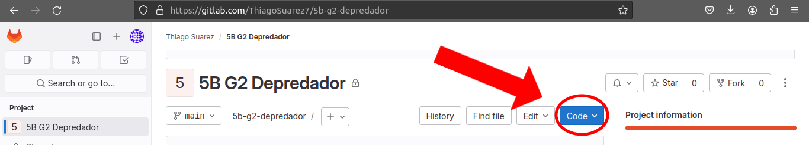
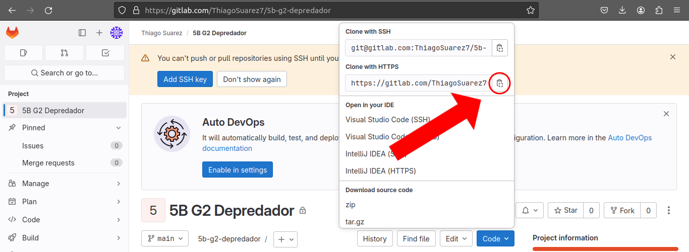
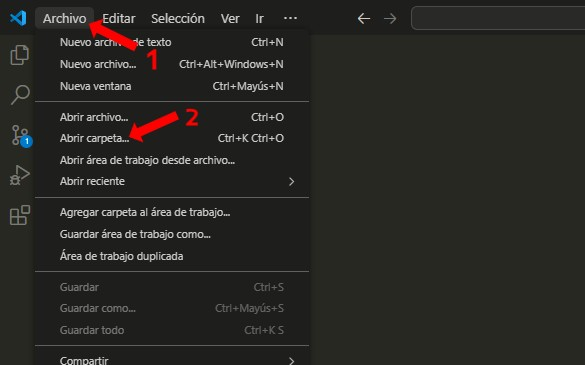
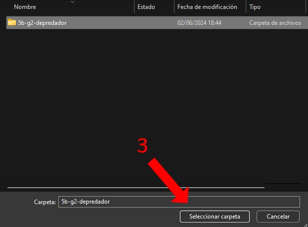
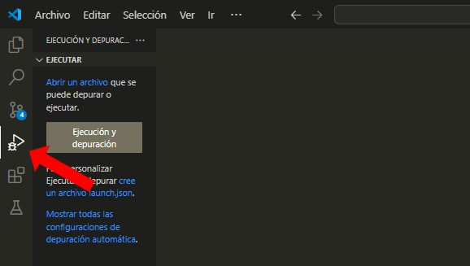

# Wiki de Depredador

**Este proyecto abarcara la icónica saga de 20th Century Fox "*Depredador*".**

**Se pofundizara sobre sus diferentes peliculas, comics, juegos, apariciones en juegos, etc.**

## Tecnologias utilizadas
- HTML5
- CSS3

## Programas utilizados
- Visual Studio Code
- Git

## Instalación del proyecto
Para la instalación de este proyecto se requerira que su equipo tenga git, en caso de no tenerlo se puede instalar desde su pagina [Git](https://git-scm.com/). 

**Paso 1:**
Una vez abierto el proyecto en gitlab, iremos a la opción "Code".

**Paso 2:**
Copiaremos el enlace https.

**Paso 3:**
Abriremos una terminal y pondremos el comando `git clone` seguido del enlace del repositorio.

`git clone https://gitlab.com/ThiagoSuarez7/5b-g2-depredador.git`

Y listo, ya estará instalado en tu equipo.

## Uso del proyecto 
Para el uso del proyecto se necesita el programa "Visual Studio Code", en caso de no tenerlo se puede instalar desde su pagina [Visual Studio Code](https://code.visualstudio.com/) .

**Paso 1:**
Una vez instalado el proyecto en el equipo, abriremos Visual Studio y iremos a "File" o "Archivos", Luego a "Open folder" o "Abrir carpeta". Ahi buscaremos la carpeta para abrirla.

**Paso 2:**
Una vez abierto entraremos a "index.html" y podremos ejecutarlo con "F5" o yendo a la parte de "ejecución y depuración"

## Desarrollador
- Thiago Suarez